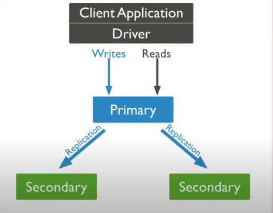
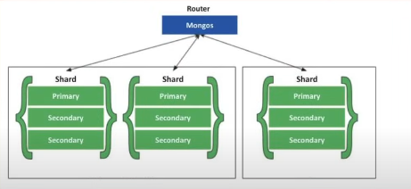
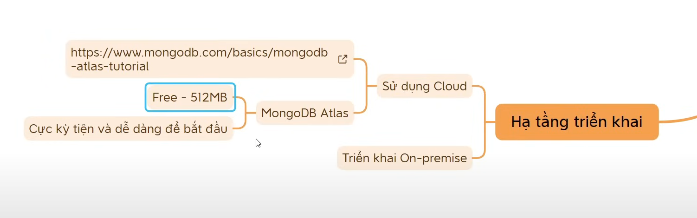
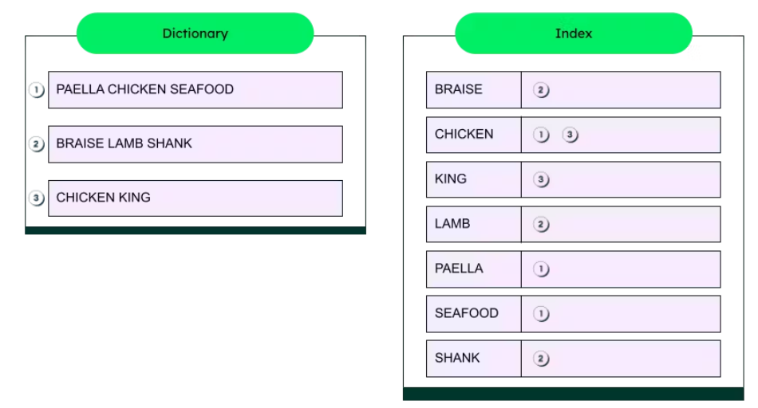

# This is repo That I learn about Database

## MongoDB

|RDBMS|Database|Table|Column|Row|Index|
|-----|--------|-----|------|---|-----|
|MongoDB|Database|Collection|Field|Document|Index|

Trong RDBMS tách thành nhiều bảng -> có quan hệ với nhau. Trong MongoDB format dữ liệu là json, điểu chú ý là có thể embeded

### Mô hình triển khai MongoDB

* `Standalone`: client Application Driver có thể đọc ghi có máy chủ duy nhất
  * Ưu điểm: dễ triển khai
  * Nhược điểm:
    * Server dễ down time.
    * Đọc/ghi vào database có thể là nhược điểm lớn.

<div align = "center">
  
</div>

* `Replication`: Có nhiều server, có một primary chịu trách nhiệm chính thực hiện các thay đổi của ứng dụng sang các secondary server.
  * Ưu điểm: Tính sẵn sàng được nâng cao
  * Nhược điểm: trong server chứa dữ liệu, khó mở rộng

<div align = "center">
  
</div>

* `Sharding`: Tất cả dữ liệu được chia đểu ở server
  * Ưu điểm: Dễ dàng mở trộng thêm chiều ngang
  * Nhược điểm:

<div align = "center">
  
</div>

### Hạ tầng triển khai




### Docker


### Full test search

#### 1. Tìm kiếm thông thường 🔍️

Syntax để implement FTS:

```bash
db.users.find(
   {
      $text: { $search: "John" }
   }
)
```

Note: Nhưng trước tiên điều kiện tiên quyết để có thể sử dụng FTS trong MongoDB là bắt buộc collection phải có **Text Index**

Tiến hành cài đặt Text Index bằng lệnh sau

```ts
// ⏬ Lưu ý loại Index chúng ta dùng ở đây bắt buộc phải là Text Index
db.users.createIndex( { "name": "text" } )
```

#### 2. Tìm kiếm một cụm từ cụ thể 🔠

Bản chất khi tìm kiếm với **FTS** các từ (term) chúng ta nhập vào sẽ được tìm kiếm một cách riêng biệt nên đôi khi sẽ không đáp ứng được một vài yêu cầu của chúng ta.

Xét ví dụ chúng ta tạo index là field address và chúng ta muốn tìm kiếm với keyword Victoria Street để trả về user đang sinh sống ở trên con đường đó. Nhưng kết quả trả về lại bao gồm cả user đang ở Boone Street

Tab Explain Plan trong MongoDB Compass hoặc nếu dùng CLI có thể dùng method explain(). Kết quả bên dưới ở phần terms sẽ là mảng chứa 2 từ riêng biệt là victoria và street, MongoDB sẽ dùng 2 từ đó để tìm kiếm kết quả chứ không phải là cụm từ Victoria Street.

Để đáp ứng trường hợp này, MongoDB cung cấp cho chúng ta syntax giúp tìm kiếm theo các cụm từ cụ thể:

```bash
{ $text: { $search: "\"Victoria Street\"" } }
```

#### 3. Loại trừ một term 🚫

Trong trường hợp các bạn muốn tìm kiếm mà cần loại bỏ các kết quả có liên quan tới một term cụ thể có thể thêm vào dấu `-`

```bash
{ $text: { $search: "John -Doe" } }
```

💡 Có thể kết hợp cả tìm kiếm theo cụm từ và loại trừ term với nhau. Ví dụ `{ $text: { $search: "Washington \"Victoria Street\" -4000" } }`: tìm các user ở Washington trên Victoria Street ngoại trừ số nhà 4000.

#### 4. How it work

[Mongodb Full-Text-Search](https://www.mongodb.com/resources/basics/full-text-search)

Substring search --> $O(N^2)$

Dữ liệu đã được index nên thay vì tìm kiếm trong `search fields` chúng ta sẽ tìm trực tiếp trong index.

💡 Do dùng index nên tốc độ tìm kiếm của nó vượt trội hơn so với thông thường

Nguyên nhân là do giá trị của field trước khi được lưu vào Index phải trải qua giai đoạn tiền xử lý rồi sau đó mới được lưu vào Index.

* **Without Diacritics**: Bước đầu tiên trong quá trình sẽ là loại bỏ các dấu câu (ví dụ é, à, hoặc ç).
* **Process Filter Words**: Bước tiếp theo sẽ loại bỏ các Stop word tùy theo language mà chúng ta setup.

💡 Các Stop word bị loại bỏ cũng đồng nghĩa với việc chúng ta không thể tìm kiếm bằng các từ này.

* **Steamming:** Bước kế tiếp là đưa các từ về nguyên bản của chúng.
* **Casing:** Bước cuối cùng là thay đổi cách viết, ở đây có thể đưa về chữ hoa hoặc chữ thường.



#### 5. Cách sử dụng nâng cao

5.1 Compound Text Index

Việc tạo Text Index không chỉ dừng lại ở việc tạo Single Text Index mà chúng ta còn có thể tạo Compound Text Index, giúp tăng phạm vi tìm kiếm.

Mỗi **collection chỉ có thể tạo duy nhất một Text Index**.

```shell
db.collections.insertMany( [
{
  name: "Living Spaces Vocabulary",
  description: "Vocabulary about types of rooms in the house such as Living Room, Kitchen, Bath Room, Dinning Room, etc.",
  level: "easy",
},
{
  name: "Kitchen Vocabulary",
  description: "Vocabulary about kitchen utensils",
  level: "easy",
},
{
  name: "Daily Life Vocabulary",
  description: "Familiar words often used in everyday life",
  level: "easy",
}
] )
```

Tăng phạm vi tìm kiếm lên thêm field `description` chúng ta có thể tạo **Compound Text Index** như bên dưới (lưu ý nhớ xóa **Text Index** cũ)

> Again there is no rose without a thorn: càng nhiều field thì việc tạo Index càng tốn nhiều thời gian và không gian.

5.2 Wildcard Text Index

Cần phân biệt giữa **Wildcard Text Index** và **Wildcard Index**. **Wildcard Text Index** hỗ trợ tìm kiếm bằng $text còn **Wildcard Index** thì không.

```bash
db.<collection>.createIndex( { "$**": "text" } )
```

Nhưng nó đi kèm với hậu quả là ảnh hưởng khá nhiều tới hiệu năng khi insert và update.

=> Từ đó có thể kết luận rằng: chỉ nên dùng **Wildcard Text Index** với các `collection` có các `field` chưa thể xác định được do yêu cầu chưa rõ ràng hoặc các `field` có thể thay đổi trong tương lai. Bên cạnh đó, MongoDB cũng khuyến khích chúng ta nên thử **re-design** lại schema trước khi phải dùng tới **Wildcard Text Index**.

5.3 Sắp xếp kết quả tìm kiếm theo độ chính xác

Search với Text Index, nó sẽ tạo ra một score, score này có tác dụng cho biết mức độ khớp của keyword tìm kiếm với document. Điểm càng cao thì khả năng nó giống với nội dung cần được tìm kiếm càng lớn

Có thể cho nó hiển thị ra bằng cách dùng project và kết hợp với sort để sắp xếp theo thứ tự

> score = (weight *data.freq* coeff * adjustment)

5.4 Sử dụng weight

Weight có thể được khai báo trong quá trình tạo Index, giúp cho biết tầm quan trọng của field đó so với các field còn lại trong Index, mặc định weight sẽ là 1 nếu chúng ta không khai báo

```bash
db.collections.insertMany( [
{
  name: "Living Spaces Vocabulary", // ⏬ Kitchen ở dưới `description`
  description: "Vocabulary about types of rooms in the house such as Living Room, Kitchen, Bath Room, Dinning Room, etc.",  
  level: "easy",
},
{
  name: "Kitchen Vocabulary", // ⏪️ Kitchen ở `name`
  description: "Vocabulary about utensils",
  level: "easy",
}
] )
```

```bash
db.collections.createIndex(
   {
     name: "text",
     description: "text"
   },
   {
     weights: {
       description: 10
      }
   }
)
```

5.5 Sử dụng default language

Trong trường hợp dự án cần sử dụng ngôn ngữ khác thay vì English thì cần phải cẩn trọng. Bởi vì quá trình tạo Text Index các bước như loại bỏ Stop word và Stemming ứng với từng ngôn ngữ sẽ có cách loại bỏ khác nhau.

```bash
db.<collection>.createIndex(
   { <field>: "text" },
   { default_language: <language> }
)
```

```bash
db.quotes.insertMany( [
   {
      _id: 1,
      quote : "La suerte protege a los audaces."
   },
   {
      _id: 2,
      quote: "Nada hay más surrealista que la realidad."
   },
   {
      _id: 3,
      quote: "Es este un puñal que veo delante de mí?"
   },
   {
      _id: 4,
      quote: "Nunca dejes que la realidad te estropee una buena historia."
   }
] )
```

Chọn ngôn ngữ phù hợp sẽ giúp cải thiện được hiệu năng của việc truy vấn tìm kiếm, vì nếu không cài đặt đúng ngôn ngữ các stop words sẽ không bị loại bỏ, dẫn đến chiếm tài nguyên và quá trình tìm kiếm cũng sẽ mất thời gian hơn.

```bash
db.quotes.createIndex(
   { quote: "text" },
   { default_language: "spanish" }
)
```

5.6 Multiples languages

Một trường hợp khá hay khác mà mình đọc được trong document của MongoDB là support tìm kiếm với document có chứa nhiều ngôn ngữ.

5.7 Fuzzy Search 🔎🌫️

Về mặt khái niệm thì Fuzzy Search là kỹ thuật giúp chúng ta tìm kiếm kết quả có nội dung gần giống với nội dung chúng ta nhập vào.

* Levenshtein Distance (Edit Distance): Thuật toán Levenshtein distance đo khoảPng cách giữa hai chuỗi bằng cách đếm số lần sửa đổi (chèn, xóa hoặc thay thế một ký tự) cần thiết để biến một chuỗi thành chuỗi kia. Kết quả cho biết mức độ giống nhau giữa hai chuỗi.

* Jaro-Winkler Distance: Thuật toán Jaro-Winkler distance cũng đo khoảng cách giữa hai chuỗi, tuy nhiên, nó tập trung vào việc so sánh các ký tự gần nhau và đánh giá các ký tự giống nhau ở phần đầu của chuỗi một cách cao hơn.

* Soundex: Soundex là một thuật toán chuyển đổi một từ thành một chuỗi ký tự số dựa trên cách phát âm của từ đó. Các từ cùng mã số Soundex thường có cách phát âm tương tự.

* Metaphone: Metaphone cũng là một thuật toán dựa trên cách phát âm của từ, nhưng nó sử dụng các quy tắc khác so với Soundex và có thể tạo ra các mã phát âm tốt hơn.

* N-grams: N-grams là một kỹ thuật tách chuỗi thành các phần con có độ dài n liên tiếp. N-grams có thể được sử dụng để so sánh chuỗi dựa trên sự xuất hiện của các phần con giống nhau.

* Cosine Similarity: Cosine similarity đo độ tương đồng giữa hai vector từ trong không gian vector. Nó thường được sử dụng trong tìm kiếm văn bản mờ và trong các ứng dụng liên quan đến phân tích văn bản.

* TF-IDF (Term Frequency-Inverse Document Frequency): TF-IDF là một phương pháp đánh giá độ quan trọng của một từ trong một tài liệu so với tất cả các tài liệu khác. Nó cũng có thể được sử dụng để tìm kiếm mờ trong các tài liệu văn bản.
