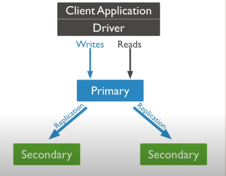
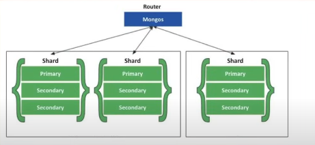
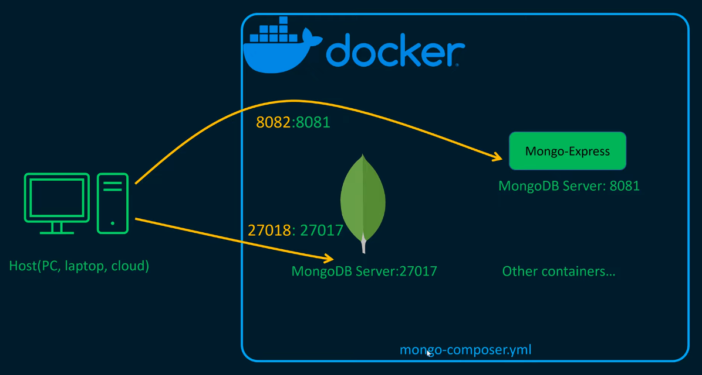

# This is repo That I learn about Database

## MongoDB

|-----|--------|-----|------|---|-----|
|RDBMS|Database|Table|Column|Row|Index|
|MongoDB|Database|Collection|Field|Document|Index|

Trong RDBMS tách thành nhiều bảng -> có quan hệ với nhau. Trong MongoDB format dữ liệu là json, điểu chú ý là có thể embeded

### Mô hình triển khai MongoDB

* `Standalone`: client Application Driver có thể đọc ghi có máy chủ duy nhất
  * Ưu điểm: dễ triển khai
  * Nhược điểm:
    * Server dễ down time.
    * Đọc/ghi vào database có thể là nhược điểm lớn.

* Replication: Có nhiều server, có một primary chịu trách nhiệm chính thực hiện các thay đổi của ứng dụng sang các secondary server.
  * Ưu điểm: Tính sẵn sàng được nâng cao
  * Nhược điểm: trong server chứa dữ liệu, khó mở rộng

* Sharding: Tất cả dữ liệu được chia đểu ở server
  * Ưu điểm: Dễ dàng mở trộng thêm chiều ngang
  * Nhược điểm:

### Hạ tầng triển khai

### Docker

