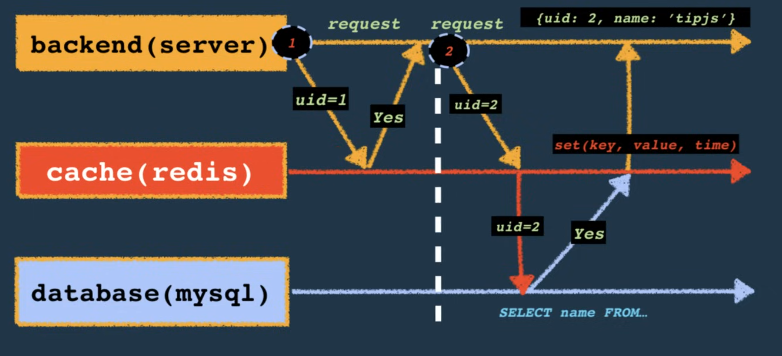
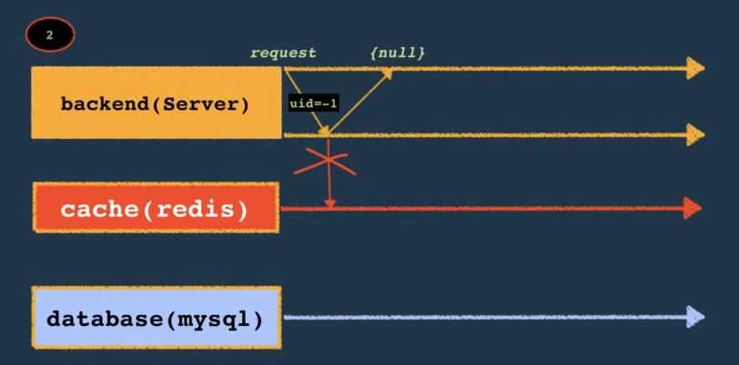
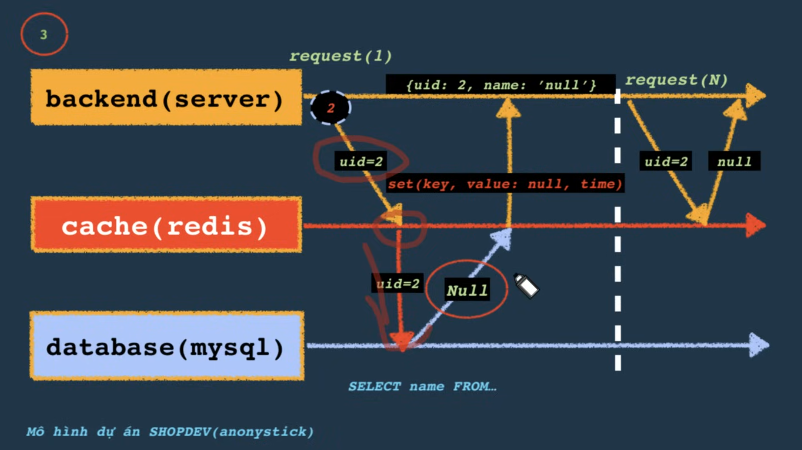
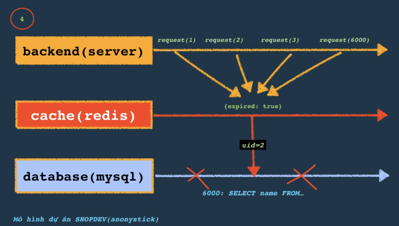

# Redis

## Document database

Understand how to use Redis as a docoment databse

Create an index

The examples in this article refer to a simple bicycle inventory that contains JSON documents with the following structure:

```json
{
  "brand": "brand name",
  "condition": "new | used | refurbished",
  "description": "description",
  "model": "model",
  "price": 0
}
```

## Pattern read cache

### Cache aside


1. Determine whethere the item is currently held in the cahce.
2. If the item is not currently iun the cache, read the imte from the data store.
3. Store a copy of the item int he cache.

## Redis penetration

===> Lazy loading



Giả sử uuid không có --> database không có --> query xuống database. Gây quá quá tải cho database

Giải pháp



Qui tắc xác minh xác định. Đưa IP của user vào trong trạng thái hệ thống nghi ngờ.



## Cache breakdown



ví dụ: 100tr user truy cập vào cache. Nhưng cache timestamp hết hạn ---> 100tr user truy cập vào database. --> database bị truy

Cách giải quyết:

* Nếu dữ liệu quan trọng, set vĩnh viễn setCacheWithoutExpiration
* Tự động gia hạn cache, cron job
* Mutex, nếu
